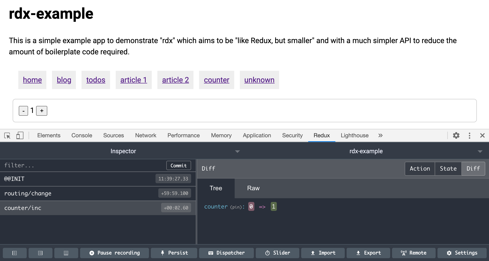

# devtools

The `devtools` store decorator adds [Redux DevTools](https://github.com/reduxjs/redux-devtools) integration to the store which allows you to inspect and manipulate the store state.

```ts
import { createStore, devtools } from '@captaincodeman/rdx'
import { config } from './config'

export const store = devtools(createStore(config))
```



Because it's a decorator, it can be combined with other decorators. Each decorator wraps the previous store, down to the original created using the `createStore` function:

```ts
import { createStore, devtools, persist } from '@captaincodeman/rdx'
import { config } from './config'

export const store = devtools(persist(createStore(config)))
```