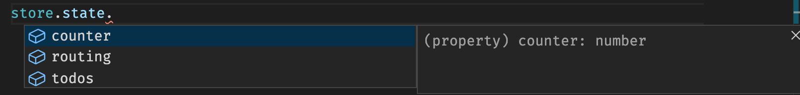
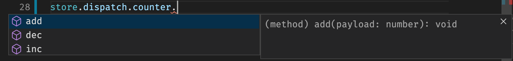

# Overview

Rdx is like Redux, but smaller.

It is a fully featured state container, that provides all the core functionality most apps require without adding a large payload to your bundle or requiring excessive boilerplate code &mdash; your app runs faster and you write less code.

Here's what you get with **_just 1.83Kb_** of JavaScript added to your app:

* A predictable, Redux-like, state container
* Integration with Redux DevTools for inspection and debugging
* Connect mixin to bind web component properties to the store &amp; dispatch actions from events
* Simpler definition of reducers with auto-generated action creators and action types
* Strongly-typed State and Dispatch functions for use with TypeScript
* Routing middleware to add route data to state store, with parameter extraction
* Effect middleware for asynchronous code (respond to actions, fetch data etc&hellip;)
* Persistence middleware to persist and re-hydrate state (e.g. to `localStorage`)

All that, for less than the size of Redux alone.

Not all apps need to persist and re-hydrate state and you may want to exclude DevTools integration for production. Without those the size becomes **_just 1.43Kb_**.

## Redux Approach

Rdx does exactly what Redux does, it just reverses how you define the reducers, action types, action interfaces and action creators. All you need to do is define the initial state and reducer functions (in a simpler way) and Rdx does the rest.

Here's the basic terminology explained based on how Redux works which will show how Rdx makes things significantly simpler.

An `Action` is a Plain Old JavaScript Object (*POJO*) that is serializable. It consists of a `type` property, which is a string that uniquely identifies that action in the store, and an optional `payload` property, which can contain additional information about the action, that the reducer might need to mutate the state. The payload can be a simple value or a complex object or array.

Here is an example of a simple `Action`:

```json
{
  "type": "counter/add",
  "payload": 5
}
```

In this case, the Action `type` is the string `counter/add`.

We could also describe the type and the interface for this action to specifically be:

```ts
export const COUNTER_ADD = 'counter/add'

export interface CounterAddAction {
  type: COUNTER_ADD,
  payload: number,
}

export type CounterActions = CounterAddAction 
                           | CounterSubtractAction
                           | CounterIncrementAction
                           | CounterDecrementAction // (additional types not shown)
```

NOTE: Technically, the `CounterAddAction` is the TypeScript _type_ of the action (object). But it can be confusing to refer to an action's type when every action also has a `type` property. So we'll try to stick to `ActionInterface` for the TypeScript _shape_ of a particular Action (it's a pity that `type` wasn't called `name`, which would be less confusing).

When using Redux, it's typical to also define an *action creator*, which is a function to create the action in a consistent way.

```ts
import { COUNTER_ADD, CounterAddAction } from './actions'

export function counterAdd(amount: number): CounterAddAction {
  return {
    type: COUNTER_ADD,
    payload: amount,
  }
}
```

Finally, we get to define a *reducer*. In Redux, this would be something like:

```ts
import { CounterActions, COUNTER_ADD } from './actions'

const counter = function(state: number = 0, action: CounterActions) {
  switch (action.type) {
    case COUNTER_ADD:
      // `action.type` acts as a 'type discriminator' in TypeScript.
      // So at this point, TypeScript knows, that the payload is a number.
      return state + action.payload
    
    default:
      // This default switch handler is _very_ important in Redux:
      // If you forget to add it, your store will be broken!
      return state
  }
}
```

Are you tired of typing variations of "Counter Add" yet?

At this point, you configure and create a `Store` instance (not shown), which allows you to retrieve the current state of your application and dispatch actions to mutate it in a predictable manner:

```ts
import { counterAdd } from './actions'
import { store } from './store'

let state = store.getState()
// initial state is { counter: 0 }

store.dispatch(counterAdd(5))
// dispatches the action { "type": "counter/add", "payload": 5 }

state = store.getState()
// updated state is now { counter: 5 }
```

Hopefully, that short overview gives you an idea of the important parts of Redux. It's actually very simple, it just makes things _appear_ complex because there are so many fragmented parts that you need to write &mdash; the need to define all these pieces is why people complain about the "boilerplate" in Redux. It can make coding with Redux a little laborious.

## Rdx Equivalent

Rdx removes the need for all that code. An action is effectively a serializable function call, with the function name as the `type` and parameters as the `payload`, so if we _have_ to write the reducer function we can infer the action, action type and action creator from it rather than have to define them ourselves. So you effectively only need to write the initial state and reducer function(s):

```ts
import { createModel } from '@captaincodeman/rdx'

export const counter = createModel({
  state: 0,
  reducers: {
    add(state, value: number) {
      return state + number
    }
  }
})
```

Through a combination of Rdx and TypeScript, the above will give you a strongly typed state store **and** dispatch methods, just like the action creators you had to write yourself. Using our store becomes simpler and we don't need to export / import as many pieces:

```ts
import { store } from './store'

// initial store.state is { counter: 0 }

store.dispatch.counter.add(5)
// dispatches the action { "type": "counter/add", "payload": 5 }

// updated store.state is now { counter: 5 }
```

Because it's all strongly typed we get full intellisense when using the store state or the dispatch.





There are many additional savings when it comes to store configuration and creation, routing and asynchronous effects. Overall the amount of code you have to write for your app is reduced, and the code you write is simpler. You get a smaller bundle size and develop quicker.
