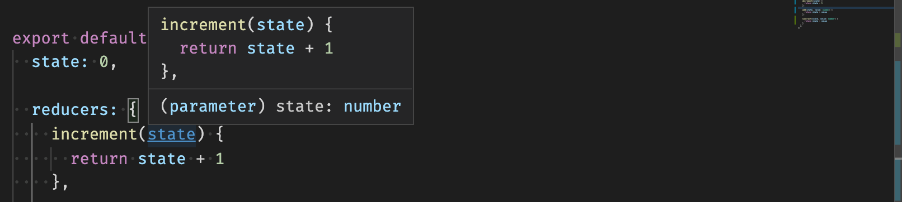
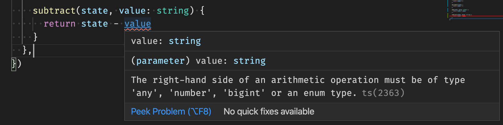
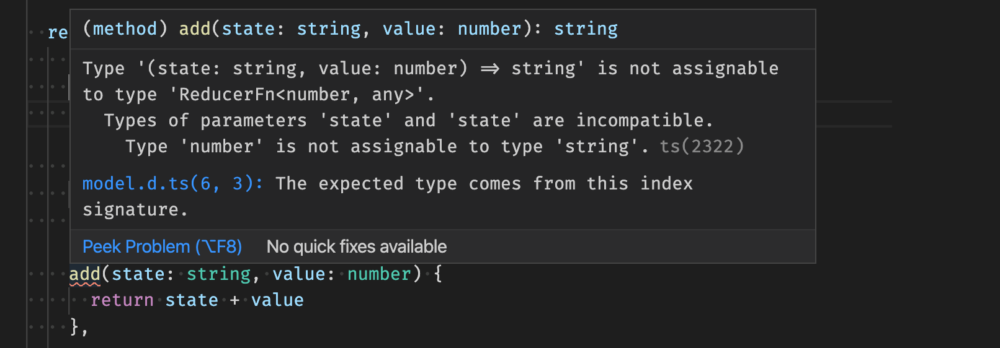

# Quickstart

Using Rdx is easy. Here's how to get started.

NOTE: This isn't intended to show you how to build and develop an app in general, only the specifics of how to use Rdx. It assumes you know how to use tools such as [npm], [TypeScript](https://www.typescriptlang.org/), [rollup](https://rollupjs.org/) etc... But for a complete ready-made example, see the [demo project](https://github.com/CaptainCodeman/rdx-demo/)

## Install Package

Rdx is available as a package on [npm] for use with a bundler / build tool. You'll want to install the package and add it to your projects dependencies:

```bash
npm install @captaincodeman/rdx
```

## Define Models

In Redux you often create different "branches" of state and combine them using the `combineReducers` function. In Rdx we call these branches `models`. We'll create a model for a basic counter to demonstrate how simple it is.

### src/state/models/counter.ts

We use the `createModel` function, which accepts the initial default state for the model and the reducer methods that can "mutate" the state. (Technically, instead of mutating the state, a new state is returned.) Thanks to TypeScript, it is automatically checked that the state type used in each reducer method matches the state type of the model. That state can be a simple value (e.g. a number) or an object with nested properties and arrays. Reducer methods can include an optional parameter. Internally that parameter becomes the `payload` in an action, but you probably won't ever need to use actions directly when using Rdx.

```ts
import { createModel } from '@captaincodeman/rdx'

export const counter = createModel({
  state: 0,

  reducers: {
    increment(state) {
      return state + 1
    },

    decrement(state) {
      return state - 1
    },

    add(state, value: number) {
      return state + value
    },

    subtract(state, value: number) {
      return state - value
    }
  }
})
```

NOTE: TypeScript inference removes the need to define the state type on each function, even with strict type checks enabled. In this example, it _knows_ that `state` is a number:



This can provide intellisense / development-time checks of your code if usage of the types doesn't make sense:



All the reducers for a model work on the same state. If you try to define a reducer with a different state type it will warn you that there is a mis-match:



### src/state/models/index.ts

We want to be able to easily import all the models that we add, so we re-export them in an `index.ts` file. As we add additional models, we'll just need to reference them in this file to have them be part of the store.

```ts
export { counter } from './counter'
```

## Create Store

To create a basic store we use the `createStore` function, passing it a configuration object. The only required property is the `models` that we want to use.

```ts
import { createStore } from '@captaincodeman/rdx'
import * as models from './models'

export const store = createStore({ models })
```

## Using the Store

That's _all_ that is required for a basic store - much simpler than Redux, eh?!

Rdx combines the state of all the models into one root state. You can refer to this from the store:

```ts
const val = store.state.counter
```

It also generates action creators for all the models reducer functions which are available from the store dispatch method:

```ts
store.dispatch.counter.increment(5)
```

But there's a lot more to Rdx, so checkout the [advanced usage](advanced) for a more complete walk-through of functionality.

[npm]: https://www.npmjs.com/