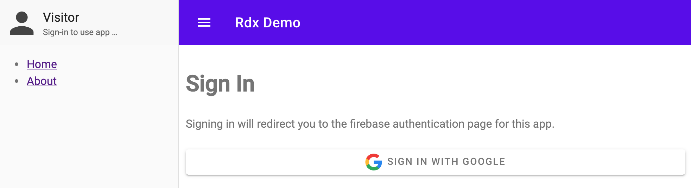
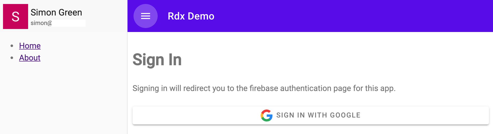

# Firebase Auth

Most apps require some kind of authentication to identify the user and allow them secure access to their own data.

[Firebase Auth](https://firebase.google.com/products/auth) is a powerful and free auth service from Google that supports multiple auth providers (Google, Firebase, Twitter, Microsoft, Github, Apple, Yahoo and more) as well as other auth methods such as email + password, email only (passwordless), phone, and anonymous accounts.

While Firebase does provide a ready-made UI library as part of auth, it is fairly large and doesn't work well with modern web component based apps. As with many other things, there are benefits to integrating the auth state into your state store, as other models will often want to respond to auth status changes or make use of auth data to securely fetch data.

## Auth Model

Rdx, of course, makes it easy. Here's a simple model that can be used to integrate Firebase Auth into your store. Other models can then choose to make use of the `auth/signedIn` and `auth/signedOut` actions for their own data management.

```ts
import { createModel } from '@captaincodeman/rdx'
import { State, Store } from '../store'
import { auth } from '../firebase'

export type User = import('firebase').User

export interface AuthState {
  user: User | null
  statusKnown: boolean
  error: string
}

export default createModel({
  state: <AuthState>{
    user: null,
    statusKnown: false,
    error: '',
  },

  reducers: {
    signedIn(state, user: User) {
      return { ...state, user, statusKnown: true }
    },

    signedOut(state) {
      return { ...state, user: null, statusKnown: true }
    },

    failed(state, error: string) {
      return { ...state, error }
    }
  },

  effects(store: Store) {
    const dispatch = store.dispatch()

    return {
      // listen to firebase auth state changes and reflect in state
      async init() {
        auth.onAuthStateChanged(async user => {
          if (user) {
            dispatch.auth.signedIn(user)
          } else {
            dispatch.auth.signedOut()
          }
        })
      },

      // provide whatever signin methods you want to support
      async signinProvider(name: string) {
        try {
          const provider = providerFromName(name)
          await auth.signInWithRedirect(provider)
        } catch (err) {
          dispatch.auth.failed(err.message)
        }
      },

      async signinEmailPassword(payload: { email: string, password: string }) {
        try {
          await auth.signInWithEmailAndPassword(payload.email, payload.password)
        } catch (err) {
          dispatch.auth.failed(err.message)
        }
      },

      // provide signout method
      async signout() {
        await auth.signOut()
      },
    }
  }
})

function providerFromName(name: string) {
  // add whatever firebase auth providers are supported by the app
  switch (name) {
    case 'google': return new window.firebase.auth.GoogleAuthProvider()
    case 'facebook': return new window.firebase.auth.FacebookAuthProvider()
    case 'twitter': return new window.firebase.auth.TwitterAuthProvider()
    default: throw new Error(`unknown provider ${name}`)
  }
}
```

Note the imported `auth` is the configured and loaded Firebase auth object as per the SDK examples (not shown here). It's also possible to lazy-load the firebase packages as they are fairly large and making them asynchronous can speed up the initial rendering of your app, but when startup time and total JS bundle size is a concern be sure to checkout the [firebase-auth-lite](https://github.com/samuelgozi/firebase-auth-lite) package for an excellent and much smaller alternative - the code is very easy to adapt and it makes a perfect companion to the tiny size approach of Rdx.

## Auth Status UI

The UI can easily show the auth status to the user with a web component connected to the store. This example is designed to fit in the top of a material design drawer:

**anonymous state**



**authenticated state**



```ts
import { property, html, customElement, css } from 'lit-element'
import { Connected, User, State, AuthSelectors } from './connected'
import { sharedStyles } from './shared-styles'

@customElement('auth-status')
export class AuthStatusElement extends Connected {
  @property({ type: Boolean })
  statusKnown: boolean

  @property({ type: Object })
  user: User

  mapState(state: State) {
    return {
      statusKnown: state.auth.statusKnown,
      user: state.auth.user,
    }
  }

  shouldUpdate() {
    return this.statusKnown
  }

  render() {
    return this.user === null
      // show visitor status if not authenticated, and link to /signin page
      ? html`
        <a href="/signin" title="Sign In">
          <svg viewBox="0 0 24 24">
            <path d="M12 12c2.21 0 4-1.79 4-4s-1.79-4-4-4-4 1.79-4 4 1.79 4 4 4zm0 2c-2.67 0-8 1.34-8 4v2h16v-2c0-2.66-5.33-4-8-4z"></path>
          </svg>
        </a>
        <div>
          <h2>Visitor</h2>
          <p>Sign-in to use app &hellip;</p>
        </div>
      `
      // show user status if authenticated, and link to /account page
      : html`
        <a href="/account" title="View Account"></a>
        <div>
          <h2>${this.user.displayName}</h2>
          <p>${this.user.email}</p>
        </div>
      `
  }

  static get styles() {
    return [
      sharedStyles,
      css`
        :host {
          width: 255px;
          height: 56px;
          padding: 3px;
          display: flex;
          box-sizing: border-box;
          contain: strict;
        }

        img, svg {
          width: 50px;
          height: 50px;
          margin-right: 5px;
          color: #444;
        }

        svg path {
          fill: #444;
        }

        h2 {
          font-size: 18px;
          line-height: 18px;
          font-weight: normal;
          margin: 8px 0 6px 0;
          color: #222;
        }

        p {
          font-size: 12px;
          line-height: 12px;
          margin: 6px 0;
          color: #666;
        }

        div {
          overflow: hidden;
        }

        h2, p {
          text-overflow: ellipsis;
          overflow: hidden;
          white-space: nowrap;
        }

        @media (min-width: 600px) {
          :host {
            height: 64px;
            padding: 8px;
          }
        }
      `,
    ]
  }
}

declare global {
  interface HTMLElementTagNameMap {
    'auth-status': AuthStatusElement
  }
}
```

The sign-in view simply has to dispatch the appropriate action in response to a button click to trigger the sign-in process, e.g. to sign-in with Google:

```ts
dispatch.auth.signinProvider('google')
```

It can also display any auth failure messages from the state.